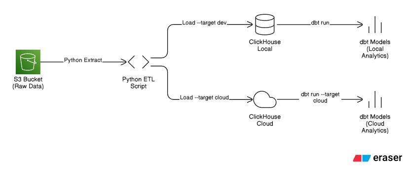

# Bike Share Analytics Engineering Documentation

## Project Overview

This project implements a data analytics pipeline for Citi Bike Jersey City trip data (2025). It uses a modern data stack containerized with Docker, allowing for flexible development against both local resources and cloud infrastructure.

* **Data Source**: Citi Bike Jersey City trip data (S3)
* **Database**: ClickHouse (OLAP) - Supports both **Local Docker** and **ClickHouse Cloud**
* **Transformation**: dbt (data build tool)
* **Orchestration**: Python scripts & Docker Compose

## Architecture



## Data Flow

1. **Extract**: Python script downloads CSV files from an S3 bucket or reads from a local directory.
2. **Load**: Python script ingests raw data into ClickHouse.
      * *Option A:* Loads into local ClickHouse container.
      * *Option B:* Loads into ClickHouse Cloud via secure HTTP.
3. **Transform**: dbt models process data through `staging` -\> `intermediate` -\> `marts`.
4. **Test**: dbt generic and singular tests validate data quality and integrity.

## Quick Start

See [Getting Started Guide](https://www.google.com/search?q=getting-started.md)

## Running the Project

The project is configured to switch easily between local development and cloud production using the `--target` flag.

### 1\. Start Environment

```bash
docker-compose up -d
docker-compose exec dbt-dev bash
```

### 2\. Choose Your Workflow
Here are the corrected sections with options for both **Sample Data** (fast) and **Full Data** (production load).

#### Option A: Local Development (Default)

Ideal for rapid testing, debugging, and offline work. Data stays inside the Docker network.

```bash
# --- Option 1: Quick Start (Sample Data) ---
# Download and load only 2 files from S3
python /usr/app/scripts/load_to_clickhouse.py --download --limit 2 --target dev

# --- Option 2: Full Pipeline (All Data) ---
# Load all CSV files currently in your local data directory
python /usr/app/scripts/load_to_clickhouse.py --dir /usr/app/data/raw --target dev

# Run transformations locally
dbt build --full-refresh

# Materialize performance projections (10-100x speedup on aggregations)
exit  # Exit dbt-dev container
docker-compose exec clickhouse clickhouse-client --password 'your_password' \
  --query "ALTER TABLE bikeshare.raw_rides MATERIALIZE PROJECTION proj_member_analysis"
docker-compose exec clickhouse clickhouse-client --password 'your_password' \
  --query "ALTER TABLE bikeshare.raw_rides MATERIALIZE PROJECTION proj_hourly_station"

# Monitor performance (optional)
docker-compose exec clickhouse clickhouse-client --password 'your_password' \
  --multiquery < scripts/monitor_clickhouse.sql
```

#### Option B: ClickHouse Cloud (Production-Ready)

Pushes data to your managed ClickHouse Cloud instance. Requires `CLICKHOUSE_CLOUD_*` variables in `.env`.

```bash
# --- Inside dbt-dev container ---
# Option 1: Cloud Test (Sample Data)
python /usr/app/scripts/load_to_clickhouse.py --download --limit 2 --target cloud

# Option 2: Production Load (Full Data)
python /usr/app/scripts/load_to_clickhouse.py --dir /usr/app/data/raw --target cloud

# Run transformations against Cloud
dbt build --full-refresh --target cloud

# --- Exit container for ClickHouse operations ---
exit

# --- From host machine ---
# Add projections to cloud (run once after initial setup)
docker-compose exec clickhouse clickhouse-client \
  --host your-id.region.aws.clickhouse.cloud \
  --port 9440 --secure \
  --user default --password 'your_cloud_password' \
  --query "ALTER TABLE bikeshare.raw_rides ADD PROJECTION IF NOT EXISTS proj_member_analysis (SELECT member_casual, rideable_type, toDate(started_at) AS ride_date, count() AS total_rides, avg(dateDiff('minute', started_at, ended_at)) AS avg_duration GROUP BY member_casual, rideable_type, ride_date)"

docker-compose exec clickhouse clickhouse-client \
  --host your-id.region.aws.clickhouse.cloud \
  --port 9440 --secure \
  --user default --password 'your_cloud_password' \
  --query "ALTER TABLE bikeshare.raw_rides ADD PROJECTION IF NOT EXISTS proj_hourly_station (SELECT start_station_id, toHour(started_at) AS hour, toDayOfWeek(started_at) IN (6, 7) AS is_weekend, count() AS ride_count GROUP BY start_station_id, hour, is_weekend)"

# Materialize projections (this processes existing data - takes a few minutes)
docker-compose exec clickhouse clickhouse-client \
  --host your-id.region.aws.clickhouse.cloud \
  --port 9440 --secure \
  --user default --password 'your_cloud_password' \
  --query "ALTER TABLE bikeshare.raw_rides MATERIALIZE PROJECTION proj_member_analysis"

docker-compose exec clickhouse clickhouse-client \
  --host your-id.region.aws.clickhouse.cloud \
  --port 9440 --secure \
  --user default --password 'your_cloud_password' \
  --query "ALTER TABLE bikeshare.raw_rides MATERIALIZE PROJECTION proj_hourly_station"
```

## Configuration (.env)

Ensure your `.env` file contains configuration for both targets:

```dotenv
# Local Connection (Internal Docker Network)
CLICKHOUSE_HOST=clickhouse
CLICKHOUSE_PORT=8123
CLICKHOUSE_USER=default
CLICKHOUSE_DB=bikeshare

# Cloud Connection (External)
CLICKHOUSE_CLOUD_HOST=your-id.region.aws.clickhouse.cloud
CLICKHOUSE_CLOUD_HTTP_PORT=8443
CLICKHOUSE_CLOUD_NATIVE_PORT=9440
CLICKHOUSE_CLOUD_PASSWORD=your_password
CLICKHOUSE_CLOUD_USER=default
```

## Directory Structure

```
.
├── data/                    # Local data storage (ignored by git)
├── data_ingestion/          # Python ETL code
│   ├── extractors/          # S3 downloader logic
│   ├── loaders/             # Database loaders
│   └── utils/               # Data cleaning & validation
├── dbt_project/             # dbt transformations
│   ├── models/
│   │   ├── staging/         # View materializations (renaming/casting)
│   │   ├── intermediate/    # Ephemeral models (complex logic)
│   │   └── marts/           # Table materializations (business BI layers)
│   ├── tests/               # Data quality tests
│   └── profiles.yml         # Connection profiles (dev/cloud)
├── scripts/                 # Entry point scripts and SQL initialization
│   ├── load_to_clickhouse.py
│   ├── init_clickhouse.sql
│   ├── monitor_clickhouse.sql
│   └── test_pipeline.sh
└── docs/                    # Documentation
```
